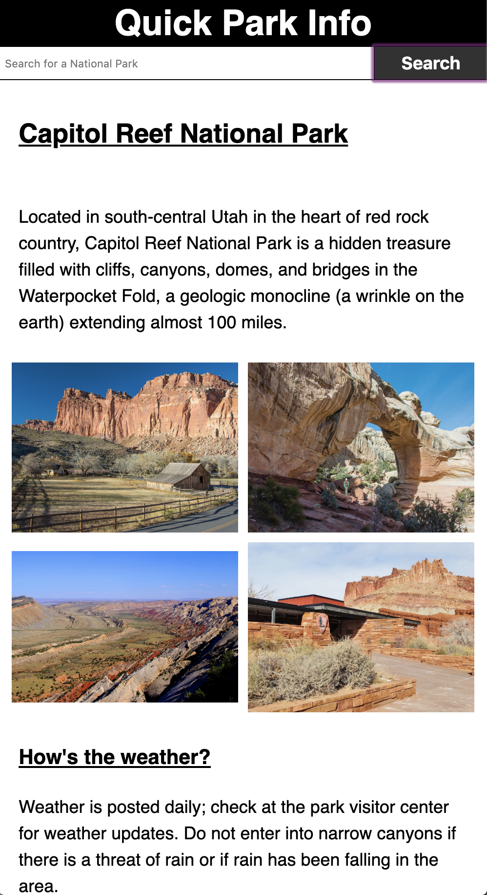

# Quick Park Info
Link: https://codylee02.github.io/park-quick-info/

Summary:
  This uses the National Parks API to get quick information for any National Park in the US. The app 
  displays to the user the park's description, some pictures, and any current alerts that the park has
  posted.

Technology Used:
  HTML/CSS/JavaScript/jQuery
  

**The user will need to get their own API key from here: https://www.nps.gov/subjects/developer/get-started.htm

To run the app locally, create a new variable called npsAPI with your API key as the value in a string.
  Ex: const npsAPI = "your-key-here";

Screenshot: 
  
